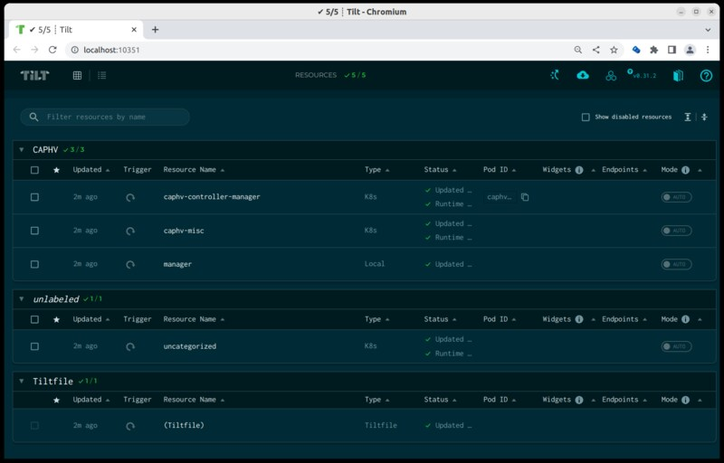
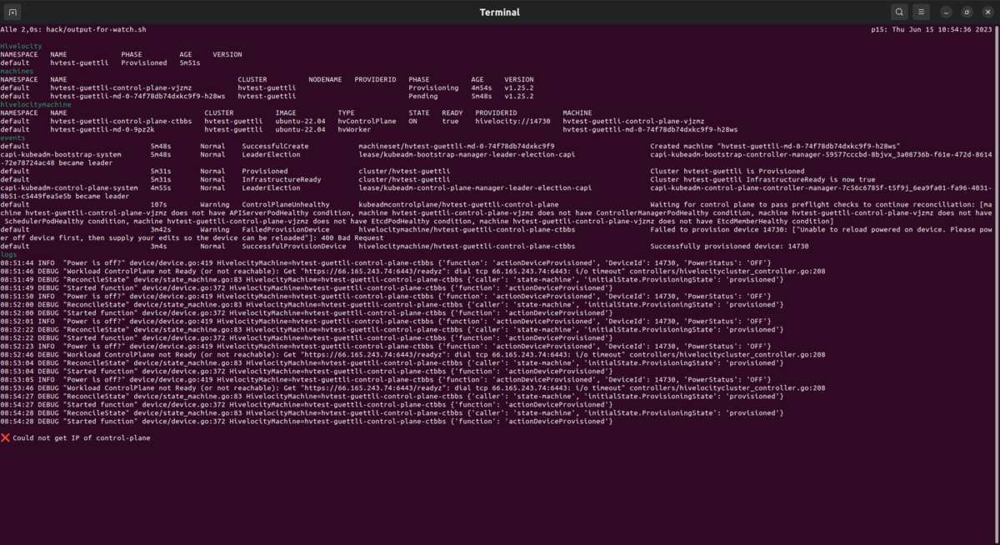

# Using Tilt for Cluster API Provider Hivelocity


We use [Tilt](https://tilt.dev/) to start a development cluster.


## Setting Tilt up

You need to create a `.envrc` file and specify the values you need. In the git repo is already a file. You can adapt it to your needs.

Machines with the corresponding `caphvlabel:deviceType=` tag will get conditionless provisioned. Be sure that you don't provision machines which run valuable workload!

We recommend to use custom device tags for testing.

More about this topic: [Provisioning Machines](../topics/provisioning-machines.md)

## Starting Tilt

```
make tilt-up
```

This will:

* install Tilt into `hack/tools/bin`.
* create a local container registry with `ctlptl`.
* create a management-cluster in [Kind](https://kind.sigs.k8s.io/)
* start [Tilt](https://tilt.dev/)

You need to press "SPACE" to open a web browser with the URL: http://localhost:10350



Be sure that all Resources are ok (5/5 in above screenshot).

At the top right side you see an up-arrow icon. You see "Create Hivelocity Cluster" if you hover the button. You can use it
to create a new workload cluster.

Open a terminal and execute [make watch](../topics/make-watch.md)



The output of [make watch](../topics/make-watch.md) updates itself. You can monitor the progress of the CAPHV controller.

Working with baremetal servers takes time. It takes roughly 20 minutes
until the ssh port of the first control plane is reachable.
