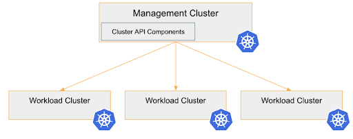

# Getting Started

## Terminology

Before we begin we need to answer some questions.

## What is Hivelocity?

Hivelocity provides Dedicated Servers, Colocation and Cloud Hosting services to customers from over 130 countries since 2002. Hivelocity operates over 70,000 sq ft of data center space offering services in Tampa FL, Miami FL, Atlanta GA, New York NY, and Los Angeles CA. Each of Hivelocity's data centers are HIPAA, PCI, ISAE-3402, SSAE 16 SOC1 & SOC2 certified.

Source: [Hivelocity at LinkedIn](https://www.linkedin.com/company/hivelocity-hosting/)

## What is Kubernetes?

Kubernetes is an open-source container orchestration system for automating software deployment, scaling, and management. Originally designed by Google, the project is now maintained by the Cloud Native Computing Foundation.

Kubernetes defines a set of building blocks that collectively provide mechanisms that deploy, maintain, and scale applications based on CPU, memory or custom metrics.

Source: [Wikpedia](https://en.wikipedia.org/wiki/Kubernetes)

## What is Cluster API?

Cluster API is a Kubernetes sub-project focused on providing declarative APIs and tooling to simplify provisioning, upgrading, and operating multiple Kubernetes clusters.

The Cluster API project uses Kubernetes-style APIs and patterns to automate cluster lifecycle management for platform operators. The supporting infrastructure, like virtual machines, networks, load balancers, and VPCs, as well as the Kubernetes cluster configuration are all defined in the same way that application developers operate deploying and managing their workloads. This enables consistent and repeatable cluster deployments across a wide variety of infrastructure environments.

Source: [cluster-api.sigs.k8s.io](https://cluster-api.sigs.k8s.io/)

Cluster API uses Kubernetes Controllers: In a **management-cluster** runs a controller which reconciles the state of **workload-clusters** until the state reaches the desired state.

The desire state gets specified in yaml manifests.

## What is Cluster API Provider Hivelocity?

Cluster API Hivelocity adds the infrastructure provider Hivelocity to the list of supported providers. Other providers supported by Cluster API are: AWS, Azure, Google Cloud Platform, OpenStack ... (See [complete list](https://cluster-api.sigs.k8s.io/reference/providers.html#infrastructure))

## Current Limitations

### Limitation: Broken Machine State

Sometimes machines get stuck. The hang in state "Reloading" forever. Then the support of Hivelocity
need to reset the machine.

Related issue at Github [#59](https://github.com/hivelocity/cluster-api-provider-hivelocity/issues/59).

### Limitation: Missing Loadbalancers

Up to now Loadbalancers are not supported yet. But we are working on it.

See [issue #55](https://github.com/hivelocity/cluster-api-provider-hivelocity/issues/55)

## Current State: alpha

Up to now CAPHV is not in the [official list of infrastructure providers](https://cluster-api.sigs.k8s.io/reference/providers.html#infrastructure).

But we are working on it.

Please have a look at the [Developer Guide](../developer/index.md), if you want to setup a cluster.

## Navigation in the docs

On the left and right side of the documentation you see angle brackets. You can use them to switch 
to the next/previous page.
